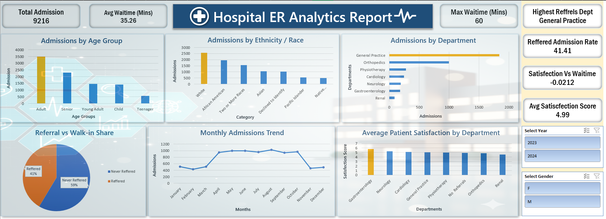

# 🏥 Hospital ER Analytics Report

**A concise, interactive Excel dashboard that visualises Emergency Department performance — admissions, wait times, referrals, departmental load, and patient satisfaction — to support operational decisions.**

---

## 🎯 Objective
Provide a single-page, data-driven view of ER operations to:
- Monitor admissions trends and seasonal patterns  
- Identify high-demand departments and demographic segments  
- Track referral vs walk-in composition and wait-time impact  
- Highlight department-level patient satisfaction for targeted improvements

---

## 🗂 Datasets (brief description)
The dashboard is built from structured ER operational data containing the following logical tables:

- **Admissions** — Visit-level records (timestamps, department, referral source, admission counts).  
- **Patients / Demographics** — Age group, ethnicity/race, gender, and related attributes.  
- **Satisfaction & Operations** — Delivery/wait times, satisfaction scores, and department mappings.

*(These descriptions explain the dataset structure used to derive the dashboard metrics.)*

---

## 📊 Key Insights (concise, chart-by-chart)
- **Admissions by Age Group:** Adults are the largest admission segment; teenagers contribute the least — prioritise adult-focused capacity planning.  
- **Admissions by Ethnicity:** “White” and “African American” categories show the highest volumes; demographic distribution suggests targeted outreach where needed.  
- **Admissions by Department:** General Practice and Orthopedics carry the highest loads — resource allocation and triage workflows should reflect this.  
- **Referral vs Walk-in Share:** Approximately ~59% walk-ins vs ~41% referred — triage and staffing must accommodate unscheduled arrivals.  
- **Monthly Admissions Trend:** Clear seasonality — low early-year volumes, mid-year peak; use this for staffing forecasts and supply planning.  
- **Average Patient Satisfaction by Department:** Overall satisfaction is moderate (~5.0 average); higher-scoring departments can inform best practices, while lower ones need improvement focus.

---

## ✅ Final Summary
This dashboard converts operational ER data into a compact, actionable view for administrators and clinical managers. By surfacing admissions patterns, departmental pressures, referral dynamics, and satisfaction signals, it enables targeted operational adjustments — from realigning staff rosters and triage protocols to investigating department-specific care quality improvements.

---

## 👤 Author
**Parveen Jalwal**  
Email: `parvenjalwal8 at the rate gmail.com`  
LinkedIn: https://www.linkedin.com/in/parveen-jalwal-201a2a302

---

## 🖼️ Dashboard Preview

