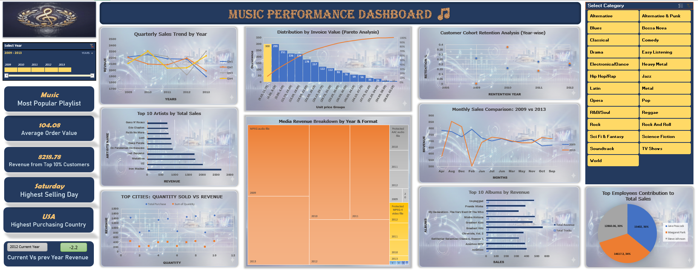

# 🎻 Business Insights Dictionary
### *A High-Fidelity Music Store Analytics Suite*

> **"Data is not just numbers; it is the sheet music of business performance."**

---

## 🏛️ Project Summary
**Business Insights Dictionary** is a strategic analytics dashboard designed to decode the operational heartbeat of a digital music store. 

Moving beyond standard "flat" reporting, this project introduces a **"Dark Glass" UI architecture** with a **Slate Blue & Gold** premium aesthetic. It functions as a comprehensive "Dictionary" for decision-makers, providing instant, high-contrast definitions for critical business metrics—from **Artist Performance** and **VIP Client Tiers** to **Financial Correlations** and **Seasonal Trends**.

---

## 🎯 Objective
To transform the raw **Chinook Database** (Retail Music Data) into a visually immersive, executive-grade interface that answers four critical business questions:
1.  **Product Intelligence:** Which artists and genres drive the bulk of our revenue?
2.  **Customer & Staff:** Who are the high-value "Whales" and top-performing agents?
3.  **Temporal Trends:** How does seasonality and historical performance dictate future strategy?
4.  **Financial Health:** What are the vital signs of our pricing power and invoice values?

---

## 🗂️ The Data Architecture
This dashboard is engineered from a relational SQL dataset, utilizing the following core tables to weave the story:

* **Product:** `Artist.csv`, `Album.csv`, `Genre.csv`, `Track.csv` (Inventory & Content)
* **Sales:** `Invoice.csv`, `InvoiceLine.csv` (Revenue & Transactional Heatmaps)
* **People:** `Customer.csv`, `Employee.csv` (Staff Performance & Client Segmentation)
* **Operations:** `Playlist.csv`, `MediaType.csv` (Format Preferences)

---

## 💎 Dashboard Insights & Key Metrics

### 1. 🎸 The Music & Content (Product Analysis)
* **Top Talent:** **Iron Maiden** reigns as the *Most Popular Artist*, while **Rock** stands as the highest revenue-generating genre.
* **Album Performance:** The album *Greatest Hits* dominates in both sales volume and track count.
* **Pricing Power:**
    * **Most Expensive Track:** *"Loving The Alien"*
    * **Highest Priced Artist:** *Philip Glass Ensemble*
    * **Average Unit Price:** **$3.49** (indicating a premium pricing strategy for top-tier content).

### 2. 🌟 The VIP Dictionary (Customer & Staff)
* **Top Customer:** **Pareek Manoj** is identified as the highest-value client based on cumulative purchase history.
* **Top Employee:** **Jane Peacock** leads the internal sales leaderboard.
* **Customer Hall of Fame:**
    * **Highest Avg Order Value:** *Hämäläinen Terhi*
    * **Customer with Lowest Order:** *Srivastava Puja* (Highlighting a potential churn risk).

### 3. ⏳ The Timeline (Temporal & Seasonal)
* **The Golden Year:** **2010** was the *Best Performing Year* in historical data.
* **The Slump:** **2012** is marked as the *Worst Year*, with **2013** recording the lowest revenue.
* **Seasonal Pulse:**
    * **Best Month:** **August** (Consistently high performance).
    * **Peak Activity:** The highest quantity of items was sold on **5/15/2009**.
    * **Lowest Activity:** The lowest quantity date was recorded on **11/8/2011**.

### 4. 💰 Financial Health (Revenue Intelligence)
* **Avg Invoice Value:** **$104.08** (High basket value indicates strong cross-selling).
* **Revenue Per Track:** **$12.24** on average.
* **Price Correlation:** **-0.001** (A near-zero negative correlation suggests track length has almost no impact on pricing strategy).
* **Largest Invoice ID:** Transaction #213.

---

## 🛠️ Tech Stack
* **Data Processing:** Python (Pandas) & SQL for data cleaning and relationship mapping.
* **Visualization:** Advanced Excel (No plugins used).
* **Design:** Custom "Dark Glassmorphism" Theme with Gold Accents.

---

## 👤 Author
**Parveen Jalwal**
*Data Analytics Enthusiast | SQL | Python | Advanced Excel*

* 📧 **Email:** `parvenjalwal8@gmail.com`
* 🔗 **LinkedIn:** [Connect with me on LinkedIn](https://www.linkedin.com/in/parveen-jalwal-201a2a302)
* 📍 **Location:** Haryana, India

---
*Built with precision, visualized with elegance.*
